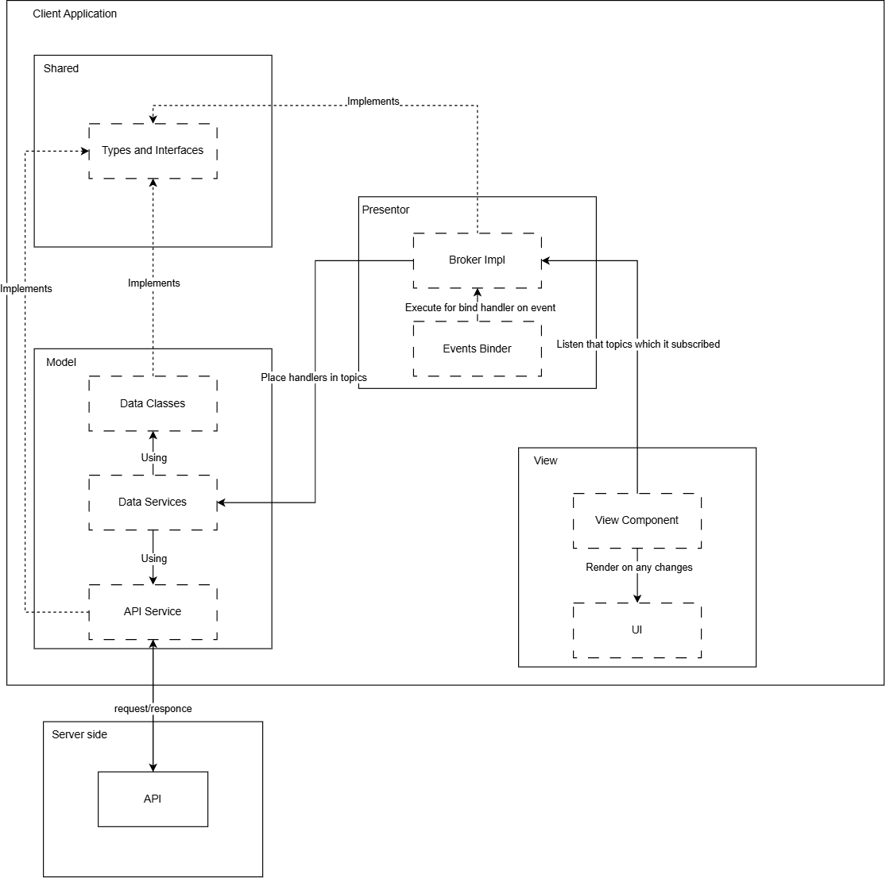

# Проектная работа "Веб-ларек"

Стек: HTML, SCSS, TS, Webpack

Структура проекта:
- src/ — исходные файлы проекта
- src/components/ — папка с JS компонентами
- src/components/base/ — папка с базовым кодом

Важные файлы:
- src/pages/index.html — HTML-файл главной страницы
- src/types/ — директория с типами
- src/index.ts — точка входа приложения
- src/scss/styles.scss — корневой файл стилей
- src/utils/constants.ts — файл с константами
- src/utils/utils.ts — файл с утилитами

## Установка и запуск
Для установки и запуска проекта необходимо выполнить команды

```
npm install
npm run start
```

или

```
yarn
yarn start
```
## Сборка

```
npm run build
```

или

```
yarn build
```

---

# Суть проекта

Веб-приложение с товарами для веб-разработчиков. Позволяет искать нужные товары в каталоге, добавлять их себе в корзину и оформлять заказ с доставкой.

---

# Архитектура

---

В основе архитектуры приложения лежит шаблон проектирования `MVP` + `Publisher-Subscriber`.



## Model

Слой данных и бизнес логики. 

К данным относятся data-классы, которые содержат соответствующие им поля.  

К сервисам относятся классы, которые работают только с соответствующими для них объектами, а также они используют сервис `Api`, который позволяет обмениваться данными с сервером. Сервис `Api` является общим для всех сервисов.

Слой модели является `publisher` в данной архитектуре.


### ICart

---

Интерфейс `ICart` описывает состояние корзины пользователя. Данная модель не делает запросов к API, корзина пользователя будет храниться локально для каждого пользователя.

Поля:
```TypeScript
id: string — уникальный идентификатор корзины;

items: IProduct[] — список товаров, добавленных в корзину.
```

Методы:

```TypeScript
putInCart(productId: string): void; - метод добавления товара в корзину.

deleteFromCart(productId: string): void; - метод удаления товара из корзины.
```

### IOrderPayload

---

Интерфейс `IOrderPayload` описывает данные заказа, отправляемые на сервер.

Поля:
```TypeScript
payment: PaymentMethod — выбранный способ оплаты;

email: string — электронная почта пользователя;

phone: string — номер телефона пользователя;

address: string — адрес доставки;

total: number — итоговая сумма заказа;

items: string[] — массив идентификаторов товаров.
```

### IPaymentData

---

Интерфейс `IPaymentData` описывает данные ответа сервера после оформления заказа.

Поля:
```TypeScript
id: string — идентификатор созданного заказа;

total: number — итоговая сумма оплаты.
```

### IProduct

---

Интерфейс `IProduct` описывает товар магазина.

Поля:
```TypeScript
id: string — уникальный идентификатор товара;

title: string — название товара;

description: string — описание товара;

image: string — ссылка на изображение товара;

category: ProductCategory — категория товара;

price: number | null — цена товара (может отсутствовать).
```

### IProductList

---

Интерфейс `IProductList` описывает список товаров, получаемых с сервера.

Поля:
```TypeScript
total: number — общее количество товаров;

items: IProduct[] — массив товаров.
```

### PaymentMethod

---

Тип `PaymentMethod` описывает допустимые способы оплаты заказа.

Возможные значения:
```TypeScript
'online' — онлайн-оплата;

'offline' — оплата при получении.
```

### ProductCategory

---

Тип `ProductCategory` описывает категорию товара.

Возможные значения:
```TypeScript
'софт-скил'

'хард-скил'

'кнопка'

'дополнительное'

'другое'
```

### AppEvent

---

Перечисление `AppEvent` содержит список событий приложения.

Значения:
```TypeScript
ProductsLoaded — товары загружены;

ProductSelected — товар выбран;

CartLoaded — корзина загружена;

ProductAddedToCart — товар добавлен в корзину;

ProductRemovedFromCart — товар удалён из корзины;

OrderSent — заказ отправлён.
```

## Services 

### IApiClient

---

Интерфейс `IApiClient` описывает базовый API-клиент для взаимодействия с сервером.

Поля:
```TypeScript
baseUrl: string — базовый адрес сервера;

options: RequestInit — параметры HTTP-запросов (заголовки и настройки).
```
Методы:
```TypeScript
get(uri: string): Promise<object>
Выполняет GET-запрос на указанный эндпоинт.

post(uri: string, data: object, method: ApiPostMethods): Promise<object>
Отправляет данные на сервер с использованием POST/PUT/DELETE-запроса по указанному эндпоинту.

handleResponse(response: Response): Promise<object>
Обрабатывает ответ сервера и возвращает данные, либо ошибку.
```

### IOrderService

---

Интерфейс `IOrderService` описывает сервис оформления заказа.

Методы:
```TypeScript
sendOrder(data: IPaymentData): Promise<IPaymentData>
Отправляет заказ на сервер и возвращает данные созданного заказа.
```

### IProductService

---

Интерфейс `IProductService` описывает сервис для работы с товарами.

Методы:
```TypeScript
getAllProducts(): Promise<IProductList>
Загружает список всех товаров.

getProductById(id: string): Promise<IProduct | undefined>
Возвращает товар по идентификатору.
```
---

## View

Слой представлений. 

Сюда относятся все классы, являющиеся view-компонентами, которые принимают в себя соответствующие данные и подписываются на соответствующие события изменения данных, для того чтобы выполнить `render()` и обновить текущий `UI`.

`UI` - то что видит пользователь. Это может быть отрисованная вёрстка веб-сайта или десктопного/мобильного приложения.

Слой представления является `subscriber` в данной архитектуре.

---

### IViewComponent

---

Интерфейс `IViewComponent` описывает базовый компонент представления.

Методы:
```TypeScript
render(data?: object): HTMLElement
Принимает данные, отрисовывает компонент и возвращает DOM-элемент.
```

### IViewConstructor

---

Интерфейс `IViewConstructor` описывает сигнатуру конструктора view-компонента.

Конструктор:
```TypeScript
new (container: HTMLElement, events: IEvents): IViewComponent
```

Параметры конструктора:
```TypeScript
container: HTMLElement — DOM-контейнер для рендера компонента;

events: IEvents — брокер событий приложения.
```

### HeaderElement

---

View-компонент `HeaderElement` отображает на экране `header` сайта с логотипом и кнопкой открытия корзины. Реализует интерфейсы `IView` и `IViewConstructor`.

Конструктор:
```TypeScript
constructor(container: HTMLElement, events: IEvents)
```

Параметры конструктора:
```TypeScript
container: HTMLElement — DOM-контейнер для рендера компонента;

events: IEvents — брокер событий приложения.
```

Методы:
```TypeScript
render(): HTMLElement
Отрисовывает `header` со статическими данными и возвращает DOM-элемент.
```

### ProductListItemElement

---

View-компонент `ProductListItemElement` отображает один товар из списка товаров для каталога. Реализует интерфейсы `IView` и `IViewConstructor`.

Конструктор:
```TypeScript
constructor(container: HTMLElement, events: IEvents)
```

Параметры конструктора:
```TypeScript
container: HTMLElement — DOM-контейнер для рендера компонента;

events: IEvents — брокер событий приложения.
```

Методы:
```TypeScript
render(data?: IProduct): HTMLElement
Принимает на входе объект продукта. Отрисовывает продукт и возвращает DOM-элемент
```


### ProductListElement

---

View-компонент `ProductListElement` отображает на экране список всех товаров. Реализует интерфейсы `IView` и `IViewConstructor`.

Конструктор:
```TypeScript
constructor(container: HTMLElement, events: IEvents)
```

Параметры конструктора:
```TypeScript
container: HTMLElement — DOM-контейнер для рендера компонента;

events: IEvents — брокер событий приложения.
```

Методы:
```TypeScript
render(data?: HTMLElement[]): HTMLElement
Принимает на входе массив уже готовых представлений продкутов. Отрисовывает список и возвращает DOM-элемент
```

### ModalComponent

---

View-компонент `ModalComponent` отображает пустое модальное окно с кнопкной его закрытия. Реализует интерфейсы `IView` и `IViewConstructor`.

Конструктор:
```TypeScript
constructor(container: HTMLElement, events: IEvents)
```

Параметры конструктора:
```TypeScript
container: HTMLElement — DOM-контейнер для рендера компонента;

events: IEvents — брокер событий приложения.
```

Методы:
```TypeScript
render(data?: HTMLElement): HTMLElement
Принимает на входе готовое представление. Отрисовывает модальное окно, наполняет его переданным компонентом и возвращает DOM-элемент
```

### ProductCardElement

---

View-компонент `ProductCardElement` отображает на экране карточку товара, с подробной информацией о товрае, а также кнопкой "В корзину". Реализует интерфейсы `IView` и `IViewConstructor`.

Конструктор:
```TypeScript
constructor(container: HTMLElement, events: IEvents)
```

Параметры конструктора:
```TypeScript
container: HTMLElement — DOM-контейнер для рендера компонента;

events: IEvents — брокер событий приложения.
```

Методы:
```TypeScript
render(data?: IProduct): HTMLElement
Принимает на входе один объект товара. Отрисовывает товар и возвращает DOM-элемент
```

### CartItemElement

---

View-компонент `CartItemElement` отображает один товар из списка товаров для корзины. Реализует интерфейсы `IView` и `IViewConstructor`.

Конструктор:
```TypeScript
constructor(container: HTMLElement, events: IEvents)
```

Параметры конструктора:
```TypeScript
container: HTMLElement — DOM-контейнер для рендера компонента;

events: IEvents — брокер событий приложения.
```

Методы:
```TypeScript
render(data?: IProduct): HTMLElement
Принимает на входе объект продукта. Отрисовывает продукт и возвращает DOM-элемент
```

### CartElement

---

View-компонент `CartElement` отображает на экране список товаров в корзине с кнопкой "Оформить". Реализует интерфейсы `IView` и `IViewConstructor`.

Конструктор:
```TypeScript
constructor(container: HTMLElement, events: IEvents)
```

Параметры конструктора:
```TypeScript
container: HTMLElement — DOM-контейнер для рендера компонента;

events: IEvents — брокер событий приложения.
```

Методы:
```TypeScript
render(data?: HTMLElement[]): HTMLElement
Принимает на входе массив уже готовых представлений продкутов. Отрисовывает корзину и возвращает DOM-элемент
```

### PaymentDataComponent

---

View-компонент `PaymentDataComponent` отображает на экране форму с данными об оплате. Реализует интерфейсы `IView` и `IViewConstructor`.

Конструктор:
```TypeScript
constructor(container: HTMLElement, events: IEvents)
```

Параметры конструктора:
```TypeScript
container: HTMLElement — DOM-контейнер для рендера компонента;

events: IEvents — брокер событий приложения.
```

Методы:
```TypeScript
render(): HTMLElement
Отрисовывает форму оплаты и возвращает DOM-элемент
```

### ContactDataComponent

---

View-компонент `ContactDataComponent` отображает на экране форму с данными о контактах заказчика. Реализует интерфейсы `IView` и `IViewConstructor`.

Конструктор:
```TypeScript
constructor(container: HTMLElement, events: IEvents)
```

Параметры конструктора:
```TypeScript
container: HTMLElement — DOM-контейнер для рендера компонента;

events: IEvents — брокер событий приложения.
```

Методы:
```TypeScript
render(): HTMLElement
Отрисовывает форму контактов и возвращает DOM-элемент
```

### OrderStatusComponent

---

View-компонент `OrderStatusComponent` отображает на экране статус заказа. Реализует интерфейсы `IView` и `IViewConstructor`.

Конструктор:
```TypeScript
constructor(container: HTMLElement, events: IEvents)
```

Параметры конструктора:
```TypeScript
container: HTMLElement — DOM-контейнер для рендера компонента;

events: IEvents — брокер событий приложения.
```

Методы:
```TypeScript
render(data?: IPaymentData): HTMLElement
Принимает на вход объект статуса оплаты. Отрисовывает статус и возвращает DOM-элемент
```

---

## Presentor

Слой управления.

Является связующим звеном для двух предыдущих слоёв и реализован, по большей части, засчёт брокера сообщений, где `publisher` выкладывает обработчик в именованный топик, а `subscriber` будет вызывать этот обработчик при смене состояния.

По скольку сервисы не отвечают за добавление обработчиков в брокер, этим будет заниматься часть презентора, которая при инициализации приложения сразу свяжет события и обработчики.

### IEvents

---

Интерфейс `IEvents` описывает контракт брокера событий, используемого для взаимодействия между слоями Model, View и Presenter.  

Методы:
```TypeScript
on<T extends object>(event: EventName, callback: (data: T) => void): void
Подписывает обработчик `callback` на событие.  
В качестве имени события может использоваться строка или регулярное выражение.

emit<T extends object>(event: string, data?: T): void
Инициирует событие с указанным именем и передаёт данные всем подписанным обработчикам.

trigger<T extends object>(event: string, context?: Partial<T>): (data: T) => void
Создаёт функцию-обработчик, которая при вызове инициирует событие с объединёнными данными.
```


